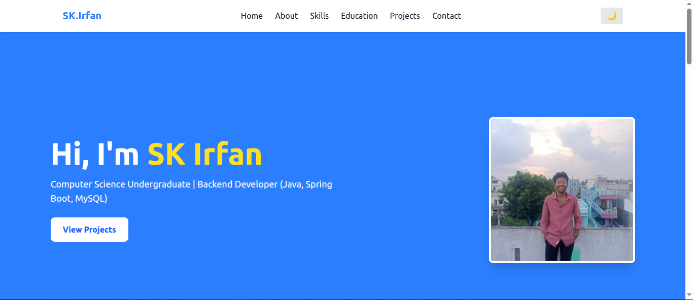

 ## 🧩 Project Overview
This is my personal portfolio website designed to showcase my:
- Skills
- Projects
- Education
- Contact information

It is a full-stack project with frontend and backend concepts.

---

## 🛠️ Tech Stack

### Frontend:
- HTML
- CSS
- JavaScript

### Backend:
- Java
- Spring Boot
- REST APIs

---

## ✨ Features
- Responsive design (mobile & desktop)
- Clean and modern UI
- About section
- Skills section
- Projects showcase
- Contact form

---

## 📁 Project Structure

frontend/
backend/

---

## ⚙️ How to Run Locally

### Backend
bash
mvn spring-boot:run

### Frontend
Open index.html in your browser.

---

## 📸 Screenshots
## Home Page

---

## 📌 Deployment
- Frontend deployed on Netlify  
- Backend built using Spring Boot

---

## 👨‍💻 Author
- Name: Irfan  
- GitHub: (add your GitHub link here)  
- Email: (optional)

---

## ⭐ Support
If you like this project, give it a ⭐ on GitHub!
